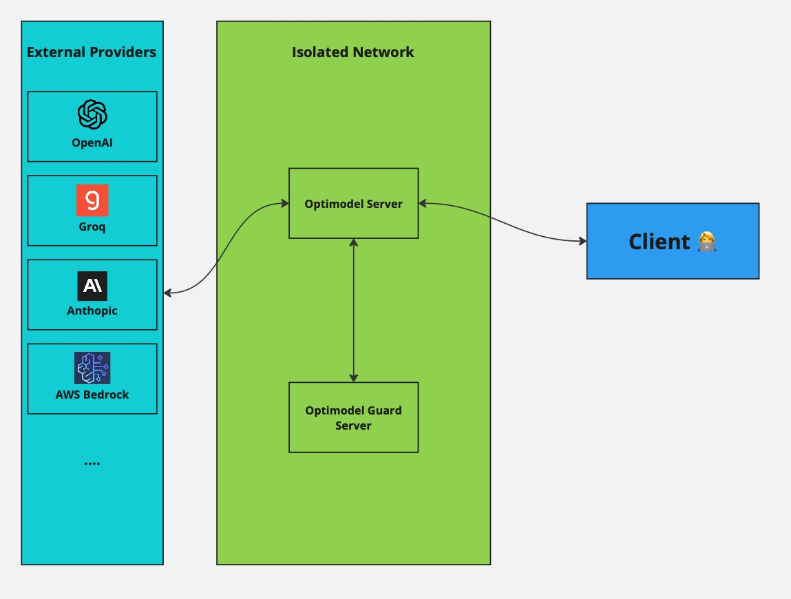

<h1 align="center">
    🧨 OptiModel
</h1>
<p align="center">
Guards and protection agnostic to your model or provider
</p>
<p align="center">
    <a href="https://lytix.co">
        
    </a>👩‍💻 
    <a href="https://discord.gg/8TCbHsSe">
        
    </a>
</p>

#### Packages

<p align="center">
<a href="https://badge.fury.io/py/optimodel-server">[Server]</a>  | 
<a href="https://badge.fury.io/py/optimodel-py"> <a href="https://badge.fury.io/py/optimodel-guard-server">[Guard Server]</a> 
</p>

## 📚 Table of Contents

- [⚡ Quickstart](#quickstart)
- [Passing In Images](#passing-in-images)
- [Optional Parameters](#optional-parameters)
- [Cloud Quickstart (lytix)](#cloud-quickstart)
- [Guards](#guards)
- [Supported Providers](#supported-providers)
- [Architecture Diagram](#architecture-diagram)
- [Contributing](#contributing)

## [⚡ Quickstart](#quickstart)

To get started you'll need to setup the server and then use the SDK to call the models.

#### Prerequisites

First decide what providers you'd like to setup. Please see [Supported Providers](#supported-providers) below to setup the providers you'd like to use and the pre-requisites for each provider.

#### Step 1: Setup the server

Now we can install our server and get it running in the background

```sh
$ pip3 install optimodel-server
$ optimodel-server
```

#### Step 2: Call our server

Optimodel uses the OpenAI SDK to call our server. See the example block on what the code might look like.

```
pip3 install openai
```

Then you can call the server just like you would call any other OpenAI compatible API:

```py
from openai import OpenAI

client = OpenAI(
    base_url=f"http://localhost:8000/proxy/v1/openai",
      default_headers={
        "openaiKey": f"{OPENAI_API_KEY}",
        # Optionally any other provider keys
        "anthropicApiKey": f"{ANTHROPIC_API_KEY}"
      },
)

response = client.chat.completions.create(
    model="gpt-4o-mini",
    # Or any other model available
    # model=ModelTypes.claude_3_5_sonnet.name,
    messages=[
        {"role": "system", "content": "You are a helpful assistant. "},
        ...
    ],
)
```

# [Passing In Images](#passing-in-images)

Passing images to any model uses the OpenAIs syntax. Underneath we'll convert the syntax for the model you're using.

```py Python
import base64

# Encode the image to base64
with open("some.png", "rb") as image_file:
    encoded_string = base64.b64encode(image_file.read())
    encoded_string = encoded_string.decode('utf-8')

response = client.chat.completions.create(
    model="gpt-4",
    messages=[
        ...
        {
            "role": "user",
            "content": [
                {"type": "text", "text": "whats this image?"},
                {
                    "type": "image_url",
                    "image_url": {
                        "url": f"data:image/jpeg;base64,{encoded_string}"
                    }
                }
            ]
        },
    ],
)
```

Then you can switch to a model such as `claude-3-5-sonnet` and pass the image in with no code changes.

```py Python
from optimodel_server_types import ModelTypes,

response = client.chat.completions.create(
    model=ModelTypes.claude_3_5_sonnet.name,
    messages=[
      # Same as above
      ...
    ],
)
```

# [Optional Parameters](#optional-parameters)

Optimodel supports a variety of optional parameters to help you get the best results.

```py
response = client.chat.completions.create(
   ...,
    extra_body={
        "lytix-fallbackModels": ...
        ...
    }
)
```

You will need to use the `optimodel-py` package to use these parameters.

```sh
pip3 install optimodel-py
```

The following optional parameters are supported:

- `lytix-fallbackModels`: Pass in a list of extra models to try if the primary model fails. This can be helpful in mitigating provider outages.
  - ```py
      from optimodel_server_types import ModelTypes
      extra_body={
        "lytix-fallbackModels": [ModelTypes.claude_3_5_sonnet.name, ...]
      }
    ```
- `lytix-guards`: Pass in a list of fallback models to use
  - ```py
      from optimodel_server_types import LLamaPromptGuardConfig
      extra_body={
          "lytix-guards": [LLamaPromptGuardConfig(
              guardName="LLamaPromptGuard",
              jailbreakThreshold=0.9999,
              guardType="preQuery", # You'll likely only want to guard the input here
          ).dict()]
      }
    ```
  - See [here](#guards) for a list of all supported guards
- `lytix-speedPriority`: Pass in a speed priority to use

  - ```py
    extra_body={
      "lytix-speedPriority": "low"
    }
    ```

  - If set to `low`, optimodel will choose the cheapest possible model across all providers (for example if you have two providers `bedrock` and `anthropic` that both offer `claude-3-opus`, optimodel will choose the `claude-3-opus` model with the lowest price regardless of which provider is faster). If set to `high`, optimodel will choose the fastest possible model across all providers.

- `lytix-provider`: Pass in a provider to use

  - ```py
    from optimodel_server_types import Providers

    extra_body={
        "lytix-provider": ProviderTypes.bedrock.name
    }
    ```

  - Explicitly specify a provider to use incase you have multiple providers available for a specific model and want to force a specific one.

<!-- Just make sure to setup our `OPTIMODEL_BASE_URL` envvar correctly:

```sh
$ OPTIMODEL_BASE_URL="http://localhost:8000/optimodel/api/v1/" python3 example.py
``` -->

<!-- #### Step 3: Add a validator

You can also optionally pass in validators and fallback models to ensure your results are what you expect. Here is an example of a simple JSON validator:

```py
def validator(x) -> bool:
    """
    Simple validator to check if the response is JSON
    """
    try:
        json.loads(x)
        return True
    except:
        return False

async def main():
    prompt = "Hello How are you?"

    response = await queryModel(
        model=ModelTypes.llama_3_8b_instruct,
        messages=[
            ModelMessage(
                role="system",
                content="You are a helpful assistant. Always respond in JSON syntax",
            ),
            ModelMessage(role="user", content=prompt),
        ],
        speedPriority="low",
        validator=validator,
        fallbackModels=[ModelTypes.llama_3_8b_instruct],
        maxGenLen=256,
    )
    print("Got response:", response)


if __name__ == "__main__":
    asyncio.run(main())

``` -->

## [Cloud Quickstart (lytix)](#cloud-quickstart)

You can also use lytix to host your server for you and interact with it from the cloud. See [here](https://docs.lytix.co/Quickstart/openai-integration) for more information.

You'll also get access to a powerful dashboard that support:

- `sessionId`
- `userId`
- `workflowName`
- `cacheTTL`

and more! 🚀

## [Guards](#guards)

```py
response = client.chat.completions.create(
    ...,
    messages=[
        ModelMessage(
            role="system",
            content="You are a helpful assistant. Always respond in JSON syntax",
        ),
        ModelMessage(role="user", content=prompt),
    ],
    extra_body={
        "lytix-guards": guards # Optional guards param
    }
)
```

You can also use Lytix to **prevent or alert** when certain types of guards are active. See [here](#adding-a-new-guard) on how to add a guard of your own.

### Blocking requests

In addition to the guard itself, you can also use the `blockRequest` flag to block requests when a guard is active and give a custom message to return instead.

```py
guards=[MicrosoftPresidioConfig(
    guardName="MICROSOFT_PRESIDIO_GUARD",
    guardType="preQuery",
    entitiesToCheck=["EMAIL_ADDRESS"],
    blockRequest=True, # Pass this to block the request
    blockRequestMessage="You are not allowed to ask about this email address" # Pass this to give a custom message
).dict()]
```

### meta-llama/Prompt-Guard-86M 

Utilize Meta's prompt guard to protect against jailbreaks and injection attacks. See the model card [here](https://huggingface.co/meta-llama/Prompt-Guard-86M) for more information.

_Note: We recommend starting with only jailbreak with a value of 0.999 unless you know what you are doing_

```py
guards=[LLamaPromptGuardConfig(
    guardName="LLamaPromptGuard",
    jailbreakThreshold=0.9999,
    guardType="preQuery", # You'll likely only want to guard the input here
).dict()]
```

### microsoft/Presidio-Guard 

Utilize Microsoft's Presidio Guard to protect against PII. See the model card [here](https://microsoft.github.io/presidio/) for more information.

```py
guards=[MicrosoftPresidioConfig(
    guardName="MICROSOFT_PRESIDIO_GUARD",
    guardType="preQuery",
    entitiesToCheck=["EMAIL_ADDRESS"], # See the model card for the full list of entities to check
).dict()]
```

### lytix/Regex-Guard 

Simple regex guard to protect against given regex patterns. See [here](https://github.com/Lytix-Labs/optimodel/blob/master/guardServer/src/optimodel_guard/Guards/RegexGuard.py#L54) for source code on how its implemented.

```py
guards=[LytixRegexConfig(
    guardName="LYTIX_REGEX_GUARD",
    regex="secrets",
    guardType="preQuery",
).dict()]
```

## [Supported Providers](#supported-providers)

### AWS Bedrock 

**Locally:** Ensure your current IAM user (`aws sts get-caller-identity`) has the correct permissions needed to call bedrock.

**SAAS Mode:** When running in SAAS mode, the API will expect the credentials param to pass in your AWS accessKey, secretKey and region. For example the curl would look like:

```
curl --location 'BASE_URL/query' \
--header 'Content-Type: application/json' \
--data '{
    "messages": [{"role": "user", "content": "hello world!"}],
    "modelToUse": "llama3_8b_instruct",
    "credentials": [{
        "awsAccessKeyId": "<access-key-id>",
        "awsSecretKey": "<secret-access-key>",
        "awsRegion": "<region>"
    }]
}'
```

### OpenAI 

**Locally:** Ensure you pass your OpenAI key in the following environment variable: `OPEN_AI_KEY`

**SAAS Mode:** When running in SAAS mode, the API will expect the credentials param to pass in your openAi key. For example the curl would look like:

```
curl --location 'BASE_URL/query' \
--header 'Content-Type: application/json' \
--data '{
    "messages": [{"role": "user", "content": "hello world!"}],
    "modelToUse": "llama3_8b_instruct",
    "credentials": [{
        "openAiKey": "<openai-key>"
    }]
}'
```

### Together AI 

**Locally:** Ensure you pass your Together AI key in the following environment variable: `TOGETHER_API_KEY`

**SAAS Mode:** When running in SAAS mode, the API will expect the credentials param to pass in your Together AI key. For example the curl would look like:

```
curl --location 'BASE_URL/query' \
--header 'Content-Type: application/json' \
--data '{
    "messages": [{"role": "user", "content": "hello world!"}],
    "modelToUse": "llama3_8b_instruct",
    "credentials": [{
        "togetherApiKey": "<together-api-key>"
    }]
}'
```

### Groq 

**Locally:** Ensure you pass your Groq API key in the following environment variable: `GROQ_API_KEY`

**SAAS Mode:** When running in SAAS mode, the API will expect the credentials param to pass in your Groq key. For example the curl would look like:

```
curl --location 'BASE_URL/query' \
--header 'Content-Type: application/json' \
--data '{
    "messages": [{"role": "user", "content": "hello world!"}],
    "modelToUse": "llama3_8b_instruct",
    "credentials": [{
        "groqApiKey": "<grok-api-key>"
    }]
}'
```

### Anthropic 

**Locally:** Ensure you pass your Anthropic API key in the following environment variable: `ANTHROPIC_API_KEY`

**SAAS Mode:** When running in SAAS mode, the API will expect the credentials param to pass in your Anthropic key. For example the curl would look like:

```
curl --location 'BASE_URL/query' \
--header 'Content-Type: application/json' \
--data '{
    "messages": [{"role": "user", "content": "hello world!"}],
    "modelToUse": "llama3_8b_instruct",
    "credentials": [{
        "anthropicApiKey": "<anthropic-api-key>"
    }]
}'
```

### Mistral 

**Locally:** Ensure you pass your Mistral API key in the following environment variable: `MISTRAL_API_KEY`

**SAAS Mode:** When running in SAAS mode, the API will expect the credentials param to pass in your Mistral key. For example the curl would look like:

```
curl --location 'BASE_URL/query' \
--header 'Content-Type: application/json' \
--data '{
    "messages": [{"role": "user", "content": "hello world!"}],
    "modelToUse": "mistral_large_v2",
    "credentials": [{
        "mistralApiKey": "<mistral-api-key>"
    }]
}'
```

### Mistral Codestral 

**Locally:** Ensure you pass your Mistral Codestral API key in the following environment variable: `MISTRAL_CODESTRAL_API_KEY`

**SAAS Mode:** When running in SAAS mode, the API will expect the credentials param to pass in your Mistral Codestral key. For example the curl would look like:

```
curl --location 'BASE_URL/query' \
--header 'Content-Type: application/json' \
--data '{
    "messages": [{"role": "user", "content": "hello world!"}],
    "modelToUse": "codestral_latest",
    "credentials": [{
        "mistralCodeStralApiKey": "<mistral-codestral-api-key>"
    }]
}'
```

### Gemini 

**Locally:** Ensure you pass your Gemini API key in the following environment variable: `GEMINI_API_KEY`

**SAAS Mode:** When running in SAAS mode, the API will expect the credentials param to pass in your Mistral Codestral key. For example the curl would look like:

```
curl --location 'BASE_URL/query' \
--header 'Content-Type: application/json' \
--data '{
    "messages": [{"role": "user", "content": "hello world!"}],
    "modelToUse": "gemini_1_5_flash",
    "credentials": [{
        "geminiApiKey": "<gemini-api-key>"
    }]
}'
```

## [Architecture Diagram](#architecture-diagram)

Following is a high level overview of the architecture of the server along with how it interacts with the client and different API providers.

<p align="center">
    
</p>

## [Contributing](#contributing)

We have a couple of guides to quickly get started adding a new provider or guard. See [here](./CONTRIBUTING.md) for more information.
